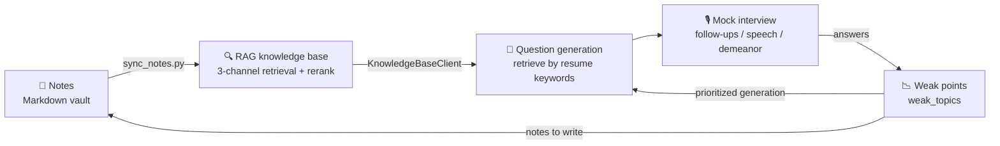
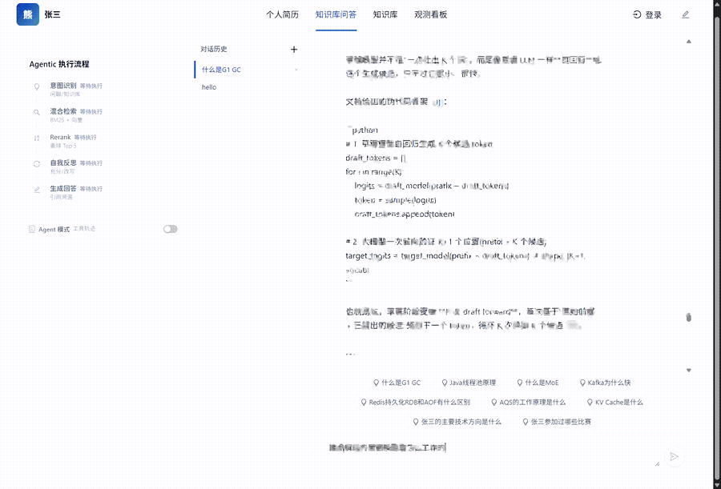

<div align="center">

# interview-loop

**Notes → Question Generation → Mock Interview → Learning**

Turn your personal knowledge base into a self-sustaining interview-training loop.

[中文说明](README.md) · [Architecture](#architecture) · [Quick start](#quick-start)

[](LICENSE)
[](#tests--engineering)
[](ai_service/)
[](interview-admin/)
[](docker/postgres/)

</div>

---

## Why

Most "AI interview" products are generic question banks in disguise: the questions have
nothing to do with what you actually know, and after answering you have no idea what you
got wrong.

This project inverts that — **your own notes are the single source of truth**:

- Questions are retrieved from *your* notes, so they ask about things you really wrote down
- Every question traces back to the original passage (`[N]` citations, click to open the source)
- Topics you score poorly on are recorded as **weak points**, and the next round of question
  generation targets them



## Live demo

The recording and screenshots below are **captured from the running system**, not mockups.
Asking "how does the draft model in speculative decoding work", the left panel shows the live
agentic pipeline while the right side streams an answer with per-sentence citations.



| Live pipeline | Pipeline finished | Retrieval hits & citations |
|---|---|---|
|  |  |  |

Observable intermediate states: **intent classification (knowledge-base, 98% confidence) →
hybrid retrieval recalled 8 passages (scores 1.000 / 0.959 / 0.919 / 0.860 / 0.842) →
rerank kept 5 of 8 (filtered 3) → self-reflection judged the evidence "sufficient" →
answer generated with sources cited down to the note's section and question number.**

## Architecture

```
   Browser ──▶ React 18 + Vite (3001)
                    │ /api/*            │ /ai/*
                    ▼                   ▼
     Spring Boot 3.2 (8081)      FastAPI AI layer (8001)
     sessions / JWT / resume     RAG pipeline / Agent / memory / MCP
                    │                   │
                    │        ┌──────────┼──────────────┐
                    │        ▼          ▼              ▼
                    │  PostgreSQL 16   Redis     local models (offline)
                    │  pgvector + AGE            bge-m3 embedding
                    │                            bge-reranker-v2-m3
                    │                            HHEM hallucination judge
                    │
                    │   ┌──────────────────────────────────────────┐
                    └──▶│ Spring Boot 3.2 interview platform (8002)│
                        │ interview-admin/  MySQL 8 + MongoDB 7    │
                        └──────────────────────────────────────────┘
                                    │ POST /ai/rag/search
                                    └──▶ back to the AI layer for context (fail-open)
```

`interview-admin` calls `POST /ai/rag/search` through `KnowledgeBaseClient` and injects the
retrieved knowledge into the question-generation prompt. Any failure (connection refused,
timeout, non-200) returns an empty string: question generation degrades to resume-only and
**never blocks the interview flow**.

## Core capabilities

**Retrieval** — three channels in parallel (full-text + pgvector + Apache AGE graph) fused
with RRF; parent/child chunking (section-level parents, ~300-char children with 50-char
overlap); local reranking; **fully offline** (embedding / rerank / hallucination judge run
locally, no external dependency).

**Agent & memory** — hand-written ReAct loop with 10 tools exposed by execution phase;
self-reflection query rewriting (up to 3 rounds); multi-layer memory (long-term preferences,
30-day decaying short-term, session context) isolated per user; conflict detection via
dual-judge consensus (nli + clf, precision 0.94 — prefers missing a conflict over
mislabeling one).

**Hallucination detection** — every sentence of the answer is verified against retrieved
documents (supported / inferred / unsupported) and color-coded in the UI. Verification is
**asynchronous**: the answer is delivered first, verification arrives afterwards.

**MCP server** — 10 tools exposed through the official MCP SDK (FastMCP), 6 read-only
retrieval tools over two transports: **stdio** (drop-in for Cursor / Claude Code / Claude
Desktop) and **Streamable HTTP** (`/ai/mcp`, Bearer token, fail-closed).

## Tests & engineering

| Layer | Tests | Status |
|---|---|---|
| AI layer (Python / pytest) | **1876** | all passing |
| Frontend (React / Vitest) | **63** | all passing |
| Interview platform (Java / JUnit) | **106** | 104 passing (2 known-red, see below) |

- **Module-based delivery**: 90+ module spec directories, each with plan / acceptance-criteria
  / changelog / review-report / test-report
- **23 ADRs** covering retrieval, chunking, memory, hallucination detection, tool governance,
  agent evaluation, MCP integration, framework comparison, context compression
- **Four-stage loop**: Planner → Developer → Reviewer → Tester, with an AST ≤ 200-line red line
  for production modules and full regression before/after every change
- **No LLM-judging-LLM**: every evaluation verdict is deterministic

### Three data-driven architecture decisions

Thresholds were fixed *before* the experiments, and unfavorable results were recorded as-is:

| Round | Question | Verdict |
|---|---|---|
| 091 | Hand-written ReAct vs LangGraph StateGraph | Equivalence fixtures **36/36 byte-identical** → keep the in-house loop |
| 092 | Multi-batch sampling | Found **65% inter-batch drift** — single-sample criteria are unreliable |
| 093 | Context compression, three arms (off / clearing / clearing+compaction) | **Clearing alone is a net loss** (history tokens *up* 31.6%) — opposite of the "safest compression" intuition |

See [`METRICS.md`](METRICS.md) and [`specs/module-091/092/093`](specs/).

## Quick start

Requirements: Docker (PostgreSQL 16 + pgvector + Apache AGE, Redis), Python 3.11+,
Node.js 18+, JDK 17+.

```bash
# 1. dependencies (first run compiles Apache AGE, ~3-8 min)
docker compose up -d && docker compose ps

# 2. environment self-check — catches the traps that look like broken code
python scripts/doctor.py

# 3. local models (~3.2 GB, not shipped in the repo) — see README.md for mirror commands

# 4. services
cd ai_service && pip install -r requirements.txt
python -m uvicorn main:app --host 0.0.0.0 --port 8001   # AI layer
cd backend && mvn spring-boot:run                        # Java backend (8081)
cd frontend && npm install && npm run dev                # UI (3001)
```

Open <http://localhost:3001>. Then feed your notes in:

```bash
python scripts/sync_notes.py \
    --vault llm-notes=/path/to/notes/llm \
    --vault backend-notes=/path/to/notes/backend
```

This goes through `/ai/rag/documents/upload` (parse → clean → 3-level dedup → parent/child
chunking → local embedding → store) and is **idempotent**: already-ingested notes are
deduplicated by content hash, only new or changed files are added.

Optional question-generation / interview platform:

```bash
cd interview-admin && docker compose up -d && ./mvnw spring-boot:run   # 8002
```

## Repository layout

```
interview-loop/
├── ai_service/            # Python AI layer (RAG · Agent · memory · MCP · eval)
├── backend/               # Java business layer (sessions · JWT · resume · documents)
├── frontend/              # React UI (chat · knowledge base · resume · feedback)
├── interview-admin/       # Spring Boot question-generation / interview platform
├── scripts/               # sync_notes.py (notes → RAG), doctor.py (env self-check)
├── docker/postgres/       # custom image: pgvector + Apache AGE
├── specs/                 # 90+ module docs + 23 ADRs
└── METRICS.md             # single source of truth for all metrics
```

## Known issues

See also **[TROUBLESHOOTING.md](TROUBLESHOOTING.md)** — 8 real deployment failures
(symptom → root cause → fix), each one disguised as a code/API bug.

- `interview-admin` has **2 tests that have never passed since import**. They encode intended
  behavior the implementation does not satisfy; a product decision is needed on whether the
  implementation or the assertion is wrong:
  1. `XunfeiAudioServiceAssemblerTest` — for segments without `pgs`, the live snapshot is
     expected to be *replaced* but is *appended* (`"AAB"` vs expected `"AB"`), showing up as
     duplicated fragments in live subtitles
  2. `InterviewRecordServiceImplTest` — Mockito in-order verification failure (the order of
     "finish session" vs "persist record" does not match)
- AI-layer tests require a local PostgreSQL + Redis and the three model checkpoints
  (CI does not cover the full AI suite)

## Third-party code

`interview-admin/` comes from the third-party open-source project **「码上面试平台」**:

| | |
|---|---|
| Backend | <https://github.com/lishuangqiang/AI-Meeting> |
| Frontend | <https://github.com/lishuangqiang/AI-Meeting-Frontend> |
| License | MIT License, Copyright (c) 2026 xunzhi-agent-team |

The original license is kept at [`interview-admin/LICENSE`](interview-admin/LICENSE) as MIT
requires. This repository adapts it: `KnowledgeBaseClient` targets this repo's AI layer,
monorepo paths, and all credentials moved to environment variables.

## License

[MIT](LICENSE)
